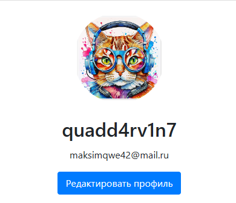

# Регистрация и авторизация пользователей в личном кабинете [Flask + Boostrap]




## Описание проекта

Проект представляет собой веб-приложение, разработанное с использованием `Flask` и `Bootstrap`, которое обеспечивает регистрацию и авторизацию пользователей.

Пользователи могут создавать учетные записи, входить в личный кабинет и управлять своим профилем.

## Структура проекта

```
flask_auth_app/
│
├── app/
│   ├── __init__.py                  # Инициализация приложения и БД
│   ├── models.py                    # Модели базы данных
│   ├── forms.py                     # Формы (регистрация, логин, восстановление пароля)
│   ├── email.py                     # Логика для отправки писем (восстановление пароля)
│   │
│   ├── routes/                      # Папка с маршрутами
│   │   ├── auth.py                  # Маршруты для авторизации, регистрации, восстановления пароля
│   │   ├── main.py                  # Маршруты для главной страницы, профиля и т.д.
│   │   ├── profile.py               # Управление профилем пользователя
│   │   └── errors.py                # Обработка ошибок (404, 500 и т.д.)
│   │
│   ├── static/                      # Статические файлы (CSS, JS, изображения)
│   │   ├── css/
│   │   │   └── styles.css           # Кастомные стили
│   │   └── js/
│   │       └── main.js              # JavaScript (включая анимации для плавных переходов)
│   │
│   └── templates/                   # HTML-шаблоны
│       ├── auth/                    # Шаблоны для страниц авторизации, регистрации и т.д.
│       │   ├── login.html           # Страница авторизации
│       │   ├── register.html        # Страница регистрации
│       │   └── reset_password.html  # Страница восстановления пароля
│       │
│       ├── errors/                  # Шаблоны для страниц ошибок
│       │   ├── 404.html
│       │   ├── 500.html
│       ├── layouts/                 # Базовые шаблоны
│       │   ├── base.html            # Основной шаблон (layout)
│       │   └── navbar.html          # Навигационная панель
│       │
│       ├── profile.html             # Страница профиля пользователя
│       └── home.html                # Главная страница
│
├── .env                             # Конфигурация среды
├── config.py                        # Основные конфигурации приложения
├── run.py                           # Точка входа для запуска приложения
├── instance/
│   └── site.db                      # База данных SQLite (генерируется автоматически)
│
└── venv/                            # Виртуальное окружение
```

```
Объяснение структуры:
app/ — основная директория приложения:
    __init__.py — инициализация приложения Flask и базы данных (SQLAlchemy).
    models.py — содержит модели базы данных (например, модель пользователя).
    forms.py — формы для регистрации, авторизации, восстановления пароля и т.д.

    routes/ — маршруты, разбитые по функциям:
        auth.py — маршруты для регистрации, входа, восстановления пароля и выхода из системы.
        main.py — маршруты для главной страницы, страницы профиля и т.д.
        profile.py — маршруты для управления профилем пользователя.
        errors.py — обработка ошибок (страницы для 404, 500 и других ошибок).

    static/ — хранит статические файлы:
        css/styles.css — кастомные стили для улучшения внешнего вида приложения с помощью Bootstrap.
        js/main.js — JavaScript для анимаций и динамики (например, плавные переходы).

    templates/ — HTML-шаблоны:
        auth/ — шаблоны для страниц авторизации, регистрации и восстановления пароля.
        errors/ — шаблоны для страниц с ошибками (например, 404 или 500).
        layouts/ — базовые шаблоны:
            base.html — основной layout, включающий подключение Bootstrap и навигацию.
            navbar.html — шаблон для навигационной панели, встраиваемой в base.html.
        profile.html — страница профиля пользователя.
        home.html — главная страница.

.env — файл для хранения секретных ключей и параметров конфигурации (не включен в репозиторий).
config.py — конфигурация приложения (например, параметры для базы данных, email).
run.py — основной файл для запуска приложения.

instance/ — директория для хранения базы данных SQLite (создается автоматически).
venv/ — виртуальное окружение для Python.
```

## Основные функции и улучшения:
1. **Авторизация и регистрация:** реализованы через `Flask-Login` и `Flask-WTF` для обработки форм.
2. **Восстановление пароля:** через `Flask-Mail`, с возможностью отправки email с инструкциями для восстановления.
3. **Плавные переходы между страницами:** реализованы через JavaScript `main.js` и CSS `styles.css` с анимациями.
4. **Использование Bootstrap:** для оформления страниц и создания адаптивного интерфейса с кастомными стилями.
5. **Модульная структура:** маршруты разбиты по функциям для удобства поддержки и расширяемости.
6. **База данных SQLite:** используется для хранения пользователей, управляется через `SQLAlchemy`
7. **Навигация:** плавная и адаптивная навигационная панель с кнопками для авторизации и регистрации (или профиля и выхода для аутентифицированных пользователей).

Эта структура легко расширяется для добавления новых страниц, функционала и стилей, а также для последующего перехода на более мощную базу данных, если это потребуется.

## Технологии:
- **Flask:** Минималистичный веб-фреймворк для создания серверной части приложения.
- **Bootstrap:** CSS-фреймворк для создания адаптивного и стильного интерфейса.
- **SQLite:** Легковесная база данных для хранения информации о пользователях и их профилях.

Этот проект идеально подходит для начинающих разработчиков, желающих изучить основы веб-разработки, а также для тех, кто хочет создать собственную платформу для управления пользовательскими учетными записями.


**Автор:** Дуплей Максим Игоревич

**Дата:** 27.09.2024

**Версия:** 1.0
